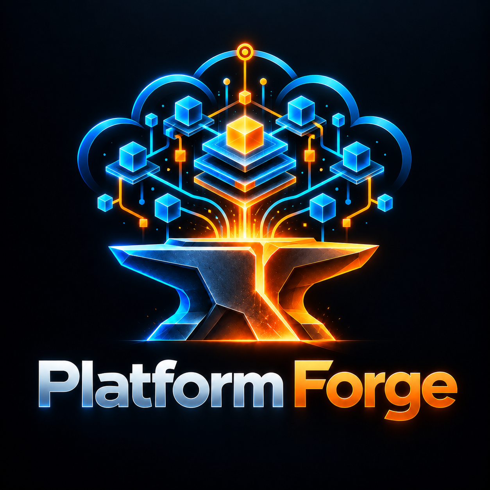

> Instalação portátil: [`docs/installation/quickstart.md`](docs/installation/quickstart.md) — clone → setup → install. Delegação agêntica: [forge.agentic.json](forge.agentic.json) (SpecialistAgenticManifest/v1).
> Docs: [commands](docs/reference/commands.md) · [skills](docs/reference/skills.md) · [agents](docs/reference/agents.md) · [tutorial](docs/tutorials/first-run.md) · [economy](docs/economy.md) · [troubleshooting](docs/installation/troubleshooting.md)
<p align="center">
  
</p>

# Platform Forge

[](https://github.com/EdgarSocrates98/platform-forge/actions/workflows/ci.yml)
[](LICENSE)
[](pyproject.toml)

**Agentic Platform Engineering intelligence platform** — deterministic,
offline-first, evidence-first, graph-aware, provider-neutral in the core.

Platform Forge reads repositories, Terraform/OpenTofu, Kubernetes, GitOps,
CI/CD, observability data, SLOs, security posture, cost and ownership — and
builds one coherent, evidence-backed model of a platform. Facts have
provenance; findings cite evidence; unanswered questions come back as
named refusals, never hedged prose.

*Versão em Português: [README.pt-BR.md](README.pt-BR.md)*

## Install

```bash
pip install -e .            # core — offline-capable
pip install -e ".[dev]"     # + tests/lint
# or: uv sync && uv pip install -e .
```

## Quick start

```bash
platformforge doctor                       # environment health
platformforge init --repo .                # scaffold .platformforge/
platformforge inspect --repo .             # inventory analyzable artifacts
platformforge analyze iac ./infra          # HCL → facts
platformforge analyze k8s ./manifests      # manifests → facts
platformforge analyze gha --repo .         # workflows → facts
platformforge analyze kyverno ./policies   # kyverno/gatekeeper → facts (version-aware)
platformforge analyze cosign bundle.json   # sigstore shape — claimed ≠ verified
platformforge analyze slsa prov.json       # SLSA requirement/evidence/gap
platformforge analyze cloud-aws ./dumps    # AWS CLI dumps → T1 facts
platformforge judge facts.json             # rules → findings
platformforge judge facts.json --versions '{"kubernetes":"1.29"}'  # version-gated rules
platformforge graph build facts.json       # facts → provenanced graph
platformforge graph blast --node X         # blast radius (per impact class)
platformforge graph identity-become --node role/x   # who can become this role
platformforge observe slo contract.yaml --sli '{"total_events":1e6,"bad_events":400}'
platformforge observe postmortem --incident i.json # unresolved root cause stays named
platformforge finops costs billing.json    # cost facts + summary
platformforge finops ingest cur.csv        # CUR/Azure/GCP/OpenCost/Kubecost → rows
platformforge finops focus-validate rows.json # FOCUS 1.0 column compliance
platformforge finops unit costs.json --denominators d.json # cost/request etc.
platformforge change review --repo . --patch diff.patch   # sandbox → graph delta → risk
platformforge product maturity --signals s.json
platformforge mcp tools                    # bounded MCP capability surface
platformforge mcp serve                    # stdio server (same core as CLI)
platformforge lab run-all                  # Forge Lab scenario suite
platformforge lab chaos lab/chaos-pod-kill # fault injection on the graph
platformforge evals run                    # eval framework (§94–95)
platformforge evals coverage               # rule ↔ case coverage matrix
platformforge evals precision              # measured false-positive rate
platformforge store gc                     # §151 — dry-run GC of stale blobs
platformforge collect ./dumps              # sniff dumps → facts
platformforge fleet report lab/fleets/acme # fleet north-star receipt
platformforge optimize scan lab/fleets/acme  # opportunities → ChangeIntent
platformforge agents list                  # canonical 41-agent roster
platformforge agents check                 # host-mirror drift gate
platformforge agents playbook "task"       # zero-subagent fallback
platformforge route '{"task":"...","risk":"high"}'  # Router V2 decision
platformforge bench scale                  # measured 10k-node/500k-edge bench
platformforge diagnose <node> --findings j.json --facts f.json
platformforge plan findings.json           # ordered remediation plan
platformforge policy check facts.json      # catalog as policy
platformforge security ./dumps             # secrets+iam+sbom+supply bundle
platformforge sdd status --feature F       # spec lifecycle + hash cascade
platformforge forge manifest               # capability manifest (interop)
```

## Pipeline

```
artifacts → analyze → facts ──► judge → findings ──► scorecards / gates
               │                                   ▲ rules/catalog/
               └──────► graph build → graphfy ──────┘ (deps, blast, diff)
```

Facts carry evidence tiers (measured → provider → plan → repo → doc →
declared → inferred). Graph edges inherit provenance. Every mutation path
goes through `inspect → propose → sandbox → verify → approve → apply`;
the core itself never mutates anything.

## Design docs

Index: [docs/README.md](docs/README.md) — ADRs, agent docs, cycle reports.

Architecture & model: [ARCHITECTURE.md](ARCHITECTURE.md) ·
[GRAPHFY.md](GRAPHFY.md) · [DOMAIN-MAP.md](DOMAIN-MAP.md) ·
[RUNTIME-TOPOLOGY.md](RUNTIME-TOPOLOGY.md) ·
[RECONCILIATION.md](RECONCILIATION.md) · [CLOUD.md](CLOUD.md) ·
[OBSERVATION-MODEL.md](OBSERVATION-MODEL.md) ·
[COMPATIBILITY.md](COMPATIBILITY.md) · [DEPRECATION.md](DEPRECATION.md)

Scale & ops: [FLEET.md](FLEET.md) · [MULTI-CLUSTER.md](MULTI-CLUSTER.md) ·
[PLATFORM-ANALYTICS.md](PLATFORM-ANALYTICS.md) ·
[OPTIMIZATION.md](OPTIMIZATION.md) · [FEDERATION.md](FEDERATION.md) ·
[OPS.md](OPS.md) · [APPROVALS.md](APPROVALS.md) · [ROLLBACK.md](ROLLBACK.md) ·
[LIVE.md](LIVE.md) · [COLLECTORS.md](COLLECTORS.md) ·
[CAPACITY.md](CAPACITY.md) · [AI-PLATFORM.md](AI-PLATFORM.md) ·
[ENTERPRISE.md](ENTERPRISE.md) ·
[GOLDEN-PATHS.md](GOLDEN-PATHS.md) ·
[GOLDEN-PATH-ANALYTICS.md](GOLDEN-PATH-ANALYTICS.md) ·
[POLICY-INTELLIGENCE.md](POLICY-INTELLIGENCE.md) ·
[PLATFORM-MEASUREMENT.md](PLATFORM-MEASUREMENT.md) ·
[INCIDENTS.md](INCIDENTS.md) · [RUNBOOKS.md](RUNBOOKS.md) ·
[EXECUTION.md](EXECUTION.md)

Agentic & economy: [AGENTIC-OS.md](AGENTIC-OS.md) ·
[docs/agents/](docs/agents/) (agentic runtime) ·
[ECONOMY.md](ECONOMY.md) · [QUALITY-PER-TOKEN.md](QUALITY-PER-TOKEN.md) ·
[KNOWLEDGE.md](KNOWLEDGE.md) · [SDD.md](SDD.md) ·
[VERIFICATION.md](VERIFICATION.md)

Rules & evidence: [RULES.md](RULES.md) · [EVALS.md](EVALS.md) ·
[SECURITY.md](SECURITY.md) · [SOURCES.md](SOURCES.md) ·
[CAPABILITIES.md](CAPABILITIES.md) · [RESEARCH.md](RESEARCH.md) ·
[docs/freeze/](docs/freeze/) (architecture freeze)

Reference: [CLI-REFERENCE.md](CLI-REFERENCE.md) (curated) ·
[docs/CLI-SURFACE.md](docs/CLI-SURFACE.md) (generated index) ·
[GLOSSARY.md](GLOSSARY.md) · [MCP.md](MCP.md) ·
[ROADMAP.md](ROADMAP.md) · [CHANGELOG.md](CHANGELOG.md) ·
[CONTRIBUTING.md](CONTRIBUTING.md) · [AGENTS.md](AGENTS.md) ·
[CODE_OF_CONDUCT.md](CODE_OF_CONDUCT.md) ·
[README.pt-BR.md](README.pt-BR.md)

## Support matrix

| Axis | Supported |
|---|---|
| Python | 3.10+ (CI tests 3.10–3.13) |
| OS | Linux (primary); macOS/Windows run the core — host adapters are platform-dependent |
| Runtime deps | PyYAML, jsonschema, python-hcl2 — offline core only |
| Optional extras | `aws` (read-only dumps), `mcp` (host surface), `dev` (pytest, ruff) |
| Host agent mirrors | `.claude/`, `.agents/`, `.codex/`, `.devin/` — generated, `agents check` gated |
| Architecture state | **Frozen** — see `docs/freeze/`; new capability requires an unfreeze RFC |

## License

MIT — see [LICENSE](LICENSE), [SOURCES.md](SOURCES.md), [CREDITS.md](CREDITS.md).

## Graph Studio

`platformforge graph view|ui` projects the built graph through
`forge/ForgeGraphView/v1` and serves the embedded local explorer (declinable at
install via `--components`). Full docs: `the-forge/docs/graph-studio/`.
